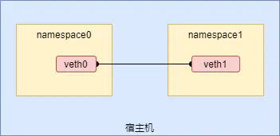
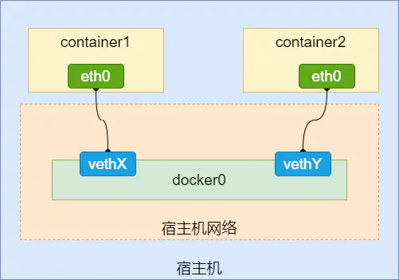

# 4.1 桥接网络模型

本文借助 `ip`命令来完成对 **Network Namespace **的各种操作，使得不同**Net Namespace**彼此之间可以通信。 `ip`命令来自于 `iproute2`安装包，一般系统会默认安装，如果没有的话，可使用`apt-get/yum install iproute2`自行安装。

## Veth Pair（Virtual Ethernet Pair）

> 成对虚拟设备端口。它总是成对出现，一端连着协议栈，一端彼此连着。从其中一个端口发出的数据包，可以直接出现在与它对应的另一个端口上，无论它们是否在相同namespace。

根据**Veth Pair**这个特性，我们就可以在不同网络命名空间搭建通道实现端到端的通信。



如上图，一对veth-pair直接将两个namespace连接在一起，下面采用`ip netns`命令创建出`Namespace`网络隔离环境模拟容器通信行为。

### 创建命名空间

```shell
cd /root
ip netns add namespace0 # 创建网络命名空间
ip netns add namespace1 # 创建网络命名空间
ip netns show
namespace1
namespace0
```

### 新增veth pair

```shell
ip addr # 打印现有的网卡列表 
ip link add veth0 type veth peer name veth1 # 创建veth-pair
ip addr # 新增如下两个网卡
46: veth1@veth0: <BROADCAST,MULTICAST,M-DOWN> mtu 1500 qdisc noop state DOWN group default qlen 1000
    link/ether 2e:c2:eb:e6:0a:20 brd ff:ff:ff:ff:ff:ff
47: veth0@veth1: <BROADCAST,MULTICAST,M-DOWN> mtu 1500 qdisc noop state DOWN group default qlen 1000
    link/ether 7e:82:8e:7b:e0:06 brd ff:ff:ff:ff:ff:ff
```

### veth关联命名空间

```shell
ip link set veth0 netns namespace0 # 将 veth 的一端移动到对应的namespace
ip link set veth1 netns namespace1 # 将 veth 的另一端移动到对应的namespace
ip addr # 发现新增两个网卡已经被移出当前网络命名空间，移入namespace0和namespace1
```

### 进程关联命名空间

```shell
ip netns exec namespace0 bash # 新建bash进程并关联到namespace0
ls -i /var/run/netns/namespace0 
4026533018 /var/run/netns/namespace0
ls -l /proc/self/ns/net
lrwxrwxrwx 1 root root 0 Aug  1 17:50 /proc/self/ns/net -> net:[4026533018] # 与/var/run/netns/namespace0 指向相同网络命名空间
```

### 分配IP地址

```
ip addr add 172.18.0.1/24 dev veth0
ip link set veth0 up # 启动veth0网卡
```

### 启动nc服务

```
nc -lp 8888
```

### echo通信

再另开一个终端进入namespace1分配IP地址、激活网卡

```
ip netns exec namespace1 bash # 新建bash进程并关联到namespace1
ip addr add 172.18.0.2/24 dev veth1
ip link set veth1 up # 启动veth1网卡

ping 172.18.0.1 # 已与namespace0连通
PING 172.18.0.1 (172.18.0.1) 56(84) bytes of data.
64 bytes from 172.18.0.1: icmp_seq=1 ttl=64 time=0.053 ms
64 bytes from 172.18.0.1: icmp_seq=2 ttl=64 time=0.045 ms
64 bytes from 172.18.0.1: icmp_seq=3 ttl=64 time=0.043 ms
```

```
telnet 172.18.0.1 8888
Trying 172.18.0.1...
Connected to 172.18.0.1.
Escape character is '^]'. # 接下来输入信息，在另外一个终端窗口会输出相应的信息，如下所示
```

```
[root@zhengyuhong ~]# telnet 172.18.0.1 8888
Trying 172.18.0.1...
Connected to 172.18.0.1.
Escape character is '^]'.
apple
```

```
[root@zhengyuhong ~]# nc -lp 8888
apple
```

以上通过veth0实现namespace之间的相互通信，如果再增加一个N个namespace，需要把veth pair添加N遍，这个不符合DRY原则（**Don't Repeat Yourself**），接下来介绍**Linux bridge**，一个**虚拟交换机**，和物理交换机有类似的功能。

## bridge

>Docker在启动时，默认会自动创建网桥设备docker0，Docker在运行时，守护进程通过docker0为Docker的容器提供网络通信服务。
 当Docker启动容器时，会创建一对Veth Pair，并将其中一个veth网络设备附加到网桥docker0，另一个加入容器的network namespace中。Docker网桥模型图如下



关闭上述所有终端窗口，重新登录root，删除namespace0、namespace1，连同命名空间内部的veth pair会被一同删除。

```
ip netns del namespace0
ip netns del namespace1
```

### 创建命名空间

添加网络命名空间namespace0、namespace1，添加两对veth pair，<veth0, veth1>、<veth2, veth3>，放veth0放入namespace0、veth2放入namespace1，分配IP地址并激活网卡

```
ip netns add namespace0
ip netns add namespace1
ip link add veth0 type veth peer name veth1 # 创建veth-pair
ip link add veth2 type veth peer name veth3 # 创建veth-pair
ip link set veth0 netns namespace0
ip link set veth2 netns namespace1
ip netns exec namespace0 ip addr add 172.18.0.1/24 dev veth0
ip netns exec namespace1 ip addr add 172.18.0.2/24 dev veth2
ip netns exec namespace0 ip link set veth0 up
ip netns exec namespace1 ip link set veth2 up
```

### 新增bridge

添加一个bridge，把veth1、veth3插入到br0，并激活veth1、veth3网卡

```
ip link add br0 type bridge
ip addr add 172.18.0.3/24 dev br0
ip link set br0 up
ip link set dev veth1 master br0
ip link set dev veth3 master br0
ip link set veth1 up
ip link set veth3 up

ip netns exec namespace0 ping 172.18.0.2
PING 172.18.0.2 (172.18.0.2) 56(84) bytes of data.
64 bytes from 172.18.0.2: icmp_seq=1 ttl=64 time=0.106 ms
64 bytes from 172.18.0.2: icmp_seq=2 ttl=64 time=0.081 ms

```

如果无法ping通，考虑系统是否为bridge开启了iptables功能，导致所有经过br0的数据包都要受iptables里面规则的限制，而docker为了安全性，将iptables里面filter表的FORWARD链的默认策略设置成了drop，于是所有不符合docker规则的数据包都不会被forward，导致这种情况ping不通。

```
# 解决办法有两个，二选一：
# 关闭系统bridge的iptables功能，这样数据包转发就不受iptables影响了：
echo 0 > /proc/sys/net/bridge/bridge-nf-call-iptables

# 为br0添加一条iptables规则，让经过br0的包能被forward，第一种方法不确定会不会影响docker，建议用第二种方法。
iptables -A FORWARD -i br0 -j ACCEPT

```

### 启动nc服务

进入namespace0，分配IP、启动nc

```
ip netns exec namespace0 bash # 新建bash进程并关联到namespace0
nc -lp 8888 # 启动nc服务
```

另开一个终端命令行窗口，进入namespace1，分配IP、启动telnet

```
ip netns exec namespace1 bash # 新建bash进程并关联到namespace1
telnet 172.18.0.1 8888 # 接下来输入信息，在172.18.0.1命名空间输出相应的信息，如下所示
Trying 172.18.0.1...
Connected to 172.18.0.1.
Escape character is '^]'.
msg from 172.18.0.2
```

```
nc -lp 8888 # 启动nc服务
msg from 172.18.0.2 
```

在宿主机`ping` `172.18.0.1` `172.18.0.2`也是连通的

```
ping 172.18.0.2
PING 172.18.0.1 (172.18.0.1) 56(84) bytes of data.
64 bytes from 172.18.0.1: icmp_seq=1 ttl=64 time=0.057 ms

ping 172.18.0.2
PING 172.18.0.2 (172.18.0.2) 56(84) bytes of data.
64 bytes from 172.18.0.2: icmp_seq=1 ttl=64 time=0.058 ms
```


## 参考

https://www.lixueduan.com/post/docker/10-bridge-network/
